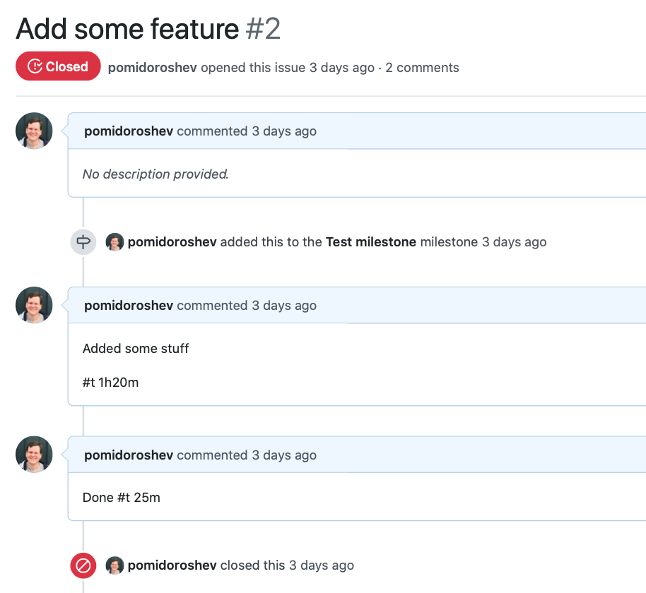

# ghtrack - simple GitHub issue-based time tracker
[](https://github.com/pomidoroshev/ghtrack/actions)

`ghtrack` scans repository issues, extracts timespans from comments and generates text report.

### How it works

Add a timespan tag to your issue comment (format: `#t 1h`, `#t 10m`, `#t 5h45m`, etc.), ang `ghtrack` will collect them and sum them up:



```
$ ./ghtrack -m 1 -s closed pomidoroshev ghtrack
<...>
Add some feature - 1h45m0s
Total: 2h43m0s
```

## Install

Download [latest release](https://github.com/pomidoroshev/ghtrack/releases/latest) for your OS and unpack it with `tar xzf` (Linux, MacOS, FreeBSD) or `zip` (Windows).

## Configuration

[Create](https://github.com/settings/tokens/new) new personal access token with `repo` scope:


The first time you run `ghtrack`, you will be asked to enter this token:

```
$ ./ghtrack -m 1 -s closed pomidoroshev ghtrack
Your GitHub token:
```

Paste your token. Credentials are saved in `config.ini`.

## Usage

```
$ ./ghtrack
Usage: ./ghtrack [OPTIONS] owner repository
  -m string
    	Milestone number: milestone number, *, none (default "*")
  -s string
    	Issue state: all, open, closed (default "all")
```

## Examples

### Collect closed issues of 1st milestone

```
$ ./ghtrack -m 1 -s closed pomidoroshev ghtrack
Fix bug - 58m0s
Add some feature - 1h45m0s
Total: 2h43m0s
```

### Collect all issues without milestone

```
$ ./ghtrack -m none pomidoroshev ghtrack
Task without milestone - 15m0s
Add readme - 0s
Total: 15m0s
```

## Development

Install Go 1.14, [pre-commit](http://pre-commit.com) and clone the repo.

```
$ cd ghtrack
$ pre-commit install --install-hooks
```

### Debug build

```
$ make
go build -o ./bin/ghtrack ./app
$ bin/ghtrack
Usage: bin/ghtrack [OPTIONS] owner repository
<...>
```

### Test and coverage

```
$ make test
go test -v ./app
=== RUN   TestCommentElapsed
<...>
PASS
ok  	ghtrack/app	0.211s
```

```
$ make cov
go test -coverprofile=.coverage ./app
<...>
go tool cover -html=.coverage
```
