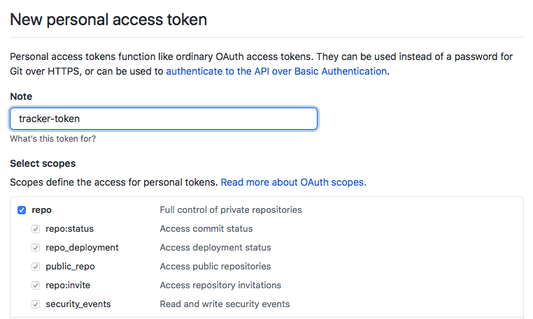
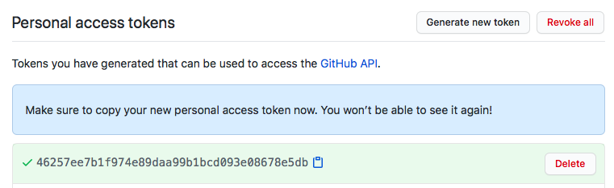

# ghtrack - simple GitHub issue-based time tracker

## Configuration

First you should [generate](https://github.com/settings/tokens/new) new personal access token with `repo`:





Copy and paste it to `config.ini`:

```
$ sed 's/#token#/46257ee7b1f974e89daa99b1bcd093e08678e5db/g' config-example.ini > config.ini
```

## Usage

```
$ ./ghtrack
Usage: bin/ghtrack [OPTIONS] owner repository
  -m string
    	Milestone number: milestone number, *, none (default "*")
  -s string
    	Issue state: all, open, closed (default "all")
```
